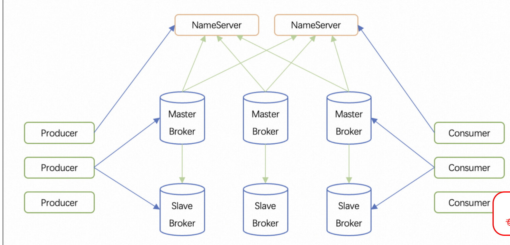
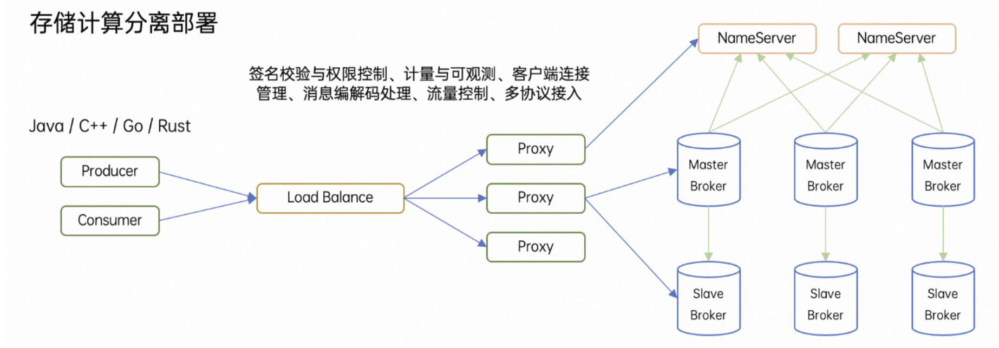
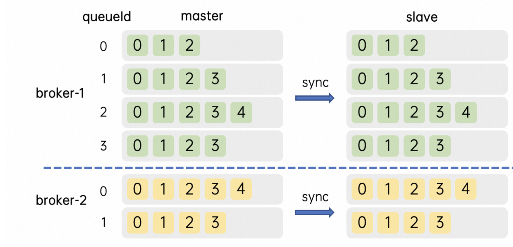
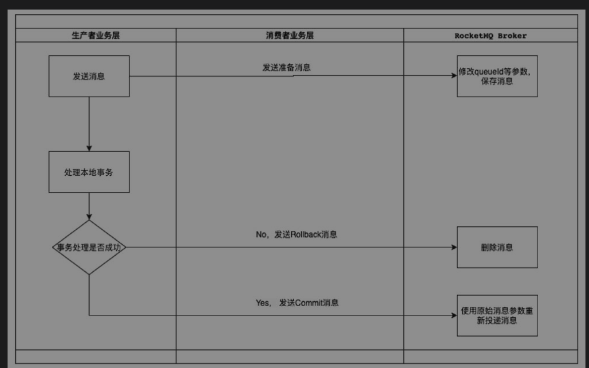
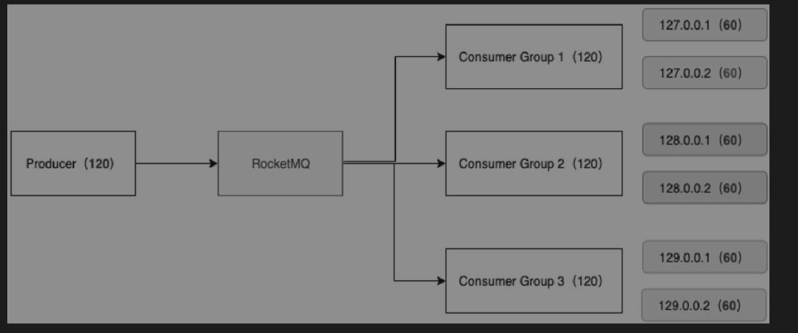
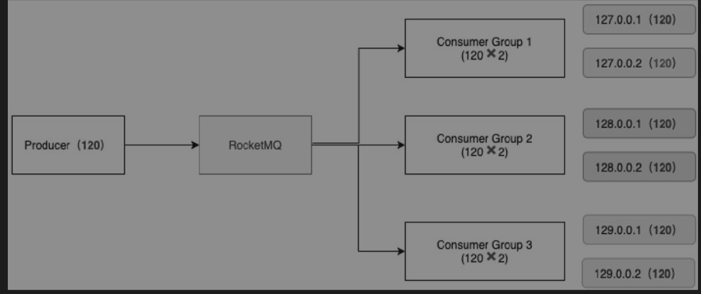
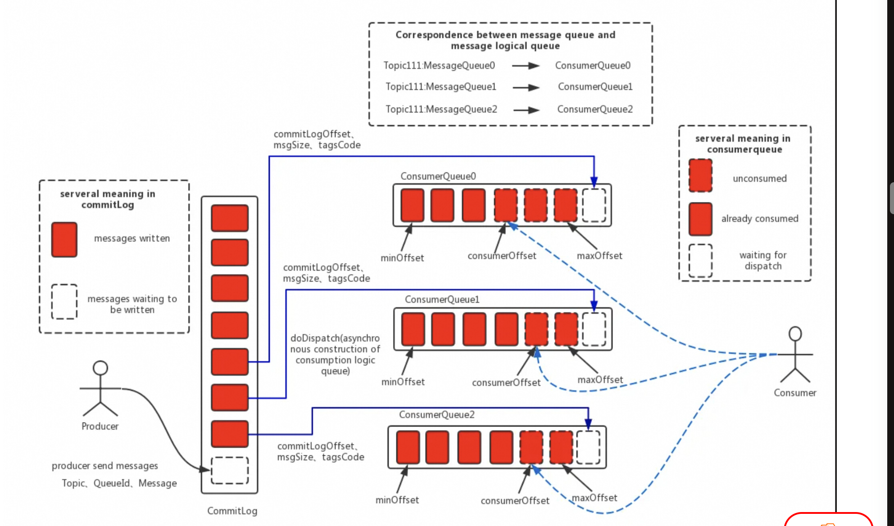

# rocket
rocket practice:,for example:send messaage and consumer message

###rocketmq
1.Message（消息）：Message 是 RocketMQ 传输的基本单元，包含了具体的业务数据以及一些元数据（如消息 ID、主题、标签、发送时间等）。消息可以是文本、二进制数据或其他任何序列化后的对象形式。

2.Topic（主题）：Topic 是一类消息的逻辑分类名，是 Apache RocketMQ 中消息传输和存储的顶层容器。类似于邮件系统中的邮箱地址或发布/订阅模式中的“频道”。生产者向特定的 Topic 发送消息，消费者则根据 Topic 订阅并接收消息。一个 Topic 可以被多个生产者写入，同时也能被多个消费者订阅。

3.Queue（队列）：每个 Topic 被划分为多个 Queue（队列），或称 MessageQueue，这些队列用于存储消息。生产者发送到 Topic 的消息会被分配到其下的各个 Queue 中；消费者则是从这些 Queue 中拉取消息进行消费。

4.Subscription（订阅）：Subscription 表示消费者对某个 Topic 消息的兴趣表达。订阅关系由消费者分组动态注册到服务端系统，并在消息传输中按照订阅关系定义的过滤规则进行消息匹配和消费进度的维护。

5.Producer（生产者）：生产者是消息产生的源头，将消息发送到服务端指定 Topic。

6.Consumer（消费者）：消费者负责从服务端中拉取消息并进行处理。

7.ProducerGroup（生产者组）：ProducerGroup 是一组生产者的逻辑分组，共享同样的 Topic 发送配置，实现发送端的负载均衡和容错。如果组内某个生产者失败，其他生产者可以继续工作，保证消息发送的连续性。

8.ConsumerGroup（消费者组）：消费者分组是 Apache RocketMQ 系统中承载多个消费行为一致的消费者的负载均衡分组。和消费者不同，消费者分组并不是运行实体，而是一个逻辑资源。分组中的消费者共同订阅同一个 Topic 并以某种策略（如广播、集群消费）消费消息。在 Apache RocketMQ 中，通过消费者分组内初始化多个消费者实现消费性能的水平扩展以及高可用容灾。

###技术架构
 1.直连模式部署：RocketMQ 的部署方式可以分为直连模式和集群模式。直连模式下，生产者和消费者直接连接到 NameServer，NameServer 会将生产者发送的消息路由到对应的 Broker，然后由 Broker 进行消息的存储和转发。这种方式适用于消息发送的实时性要求较高的场景，但 NameServer 的压力较大。
 
 2.存储计算分离部署：存储和计算分离是一种良好的模块化设计。无状态的 Proxy 集群是数据流量的入口，提供签名校验与权限控制、计量与可观测、客户端连接管理、消息编解码处理、流量控制、多协议接入等能力。原 Broker 节点演化为以存储为核心的有状态集群，支持读写多类型消息，它们的底层是多模态存储和多元化的高效索引。存储计算分离的形态利于不同业务场景下单独调整存储或计算节点的数量，来实现扩容和缩容。网关模式接入还能带来升级简单，组网便利等好处。Proxy 和 Broker 都属于服务端组件，内网通信的延迟不会显著增加客户端收发消息的延迟。
 
###元数据管理
为了提升整体的吞吐量与提供跨副本组的高可用能力，RocketMQ 服务端一般会为单个 Topic 创建多个逻辑分区，即在多个副本组上各自维护部分分区 (Partition)，我们把它称为队列 (MessageQueue)。同一个副本组上同一个 Topic 的队列数相同并从 0 开始连续编号，不同副本组上的 MessageQueue 数量可以不同。

###消息生产
1.消息发送的模式：
代码参考SendNorMessage.java中send()方法；

同步模式：同步模式下，生产者发送消息后会等待 Broker 节点返回响应，确保消息发送成功。但同步模式下，如果 Broker 节点出现故障，可能会导致消息丢失。

异步模式：异步模式下，生产者发送消息后不会等待响应，而是通过回调函数来接收 Broker 节点的响应。这种方式可以提高消息发送的效率，但也需要处理回调函数的异常情况。

2.消息发送的类型：

普通消息：普通消息是最基本的消息类型，没有特殊的属性或限制。

    tips:参考SendNormalMessage.java

顺序消息：顺序消息是一种特殊的类型，要求消息按照指定的顺序进行消费，以保证消息的处理顺序。一定是同步发送。

    tips：如果分区是1个，那么是全局顺序；其他就是队列（分区）顺序；发送方的逻辑就是根据不同的key的hash发送到不同的队列;
    参考SendOrderMessage.java

延时消息：延时消息是一种特殊的类型，可以延迟指定时间后才进行消费。
 
    tips:延时消息和定时消息都可以发送，官方给延迟时间给了几个等级。也可以自己设置。
    参考SendScheduleMessage.java

事务消息：事务消息是一种特殊的类型，要求在发送消息后，需要等待消费者确认消息的处理结果，以保证消息的事务一致性。

参考SendTransactionMessage.java

###消息消费
1.消息消费的模式：

集群模式：集群模式下，消费者会从多个 Broker 节点上拉取消息，并通过负载均衡的方式将消息分发给不同的消费者。当某个消费者出现故障时，其他消费者可以继续工作，保证消息的连续性。

广播模式：广播模式下，消费者会从单个 Broker 节点上拉取消息，并通过广播的方式将消息分发给所有的消费者。当某个消费者出现故障时，其他消费者也可以继续工作，但无法接收到新的消息。

2.DefaultLitePullConsumer：保存了一份订阅的topic和queueID以及broker的关系，当有新消息时，会通过拉取的方式获取，并更新offset的值。

    客户端维护一份toic 队列 broker的映射关系。
    某个broker挂了或者消费者挂了，都会触发rebalance，重新保存topic和队列关系。
    维护一个多线程池，用来循环拉取数据，线程池默认为20个。
    默认是自动提交offset，可以通过设置Consumer.setAutoCommit(false)来禁止自动提交。

3.具体用法可以参考ConsumerPullMessage.java和ConsumerPushMessage.java。

###namesvr

维护 Broker 的路由信息，为 Broker 提供元数据服务。
1.路由注册

Namesrv获取的 Topic路由信息来自 Broker定时心跳，心跳时 Brocker将 Topic信息和其他信息发送到Namesrv（30s）

2.路由剔除

第一种：Broker 主动关闭时，会调用 Namesrv 的取消注册 Broker 的接口RequestCode=RequestCode.UNREGISTER_BROKER，将自身从集群中删除。这个过程和5.3.1节中路由注册的过程相反。第二种：Namesrv 通过定时扫描已经下线的 Broker，将其主动剔除，实现过程在org.apache.rocketmq.namesrv.NamesrvController.initialize（​）方法中

###broker消息存储

1.消息接收

当broker接收到producer发送的消息时，会首先将消息写入CommitLog中。CommitLog是RocketMQ存储消息的物理文件，它按照顺序写入消息，保证了消息的有序性。

2.消息的分发

dispatch线程会从CommitLog中读取消息，并根据消息的主题和队列信息，将消息分发到相应的ConsumeQueue队列中。ConsumeQueue中存储的是CommitLog的偏移量（commitLogOffset）和消息大小（msgSize），实际消费时还是会去CommitLog中拿取消息内容。

3.负载均衡

RocketMQ通过负载均衡策略，将消息均匀地分发到不同的ConsumeQueue队列中。这避免了某些队列负载过重，而其他队列处于空闲状态的情况，从而提高了消息处理的效率和吞吐量。

4.高可用

如果消费者从Master Broker拉取消息时，发现拉取消息的offset和CommitLog的物理offset相差太多，会转向Slave拉取消息，这样可以减轻Master的压力，从而提高性能。

5.主从同步机制

同步复制：同步复制是指客户端发送消息到Master，Master将消息同步复制到Slave的过程，可以通过设置参数brokerRole=BrokerRole.SYNC_MASTER 来实现。

异步复制：异步复制是指客户端发送消息到 Master，再由异步线程 HAService 异步同步到 Slave的过程，可以通过设置参数 brokerRole=BrokerRole.ASYNC_MASTER 来实现

